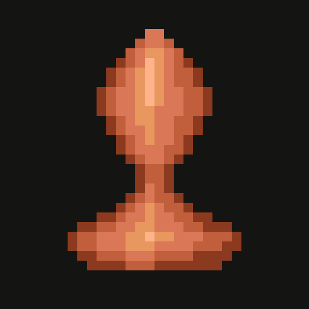

<p align="center">
  
</p>

<h1 align="center">mcp-buttplug</h1>

<p align="center">
  <strong>MCP server that gives Claude direct control over intimate hardware via <a href="https://buttplug.io">buttplug.io</a></strong>
</p>

<p align="center">
  <code>vibrate</code> &middot; <code>rotate</code> &middot; <code>oscillate</code> &middot; <code>linear</code> &middot; <code>pulse</code> &middot; <code>wave</code>
</p>

---

An [MCP](https://modelcontextprotocol.io) server that connects Claude Code (or any MCP client) to [buttplug.io](https://buttplug.io) — the open-source intimate hardware control library. Claude gets tools to discover, control, and orchestrate haptic devices in real-time.

The LLM decides what you feel, and when.

Vibe coders can now enjoy vibe coding with a vibe in the butt.

## Why

I saw girls on TikTok gooning with AI chatbots. Text-only. No haptics. Just vibes and imagination.

Also — I know many girls have toys. And many coders too ;)

Thought — what if the chatbot could actually *touch* you? MCP gives LLMs tool use. Buttplug.io gives software device control. This glues them together. Now the AI doesn't just talk. It acts.

That's it. That's the whole idea. The hardware is already in the drawer. This is just the software.

## How It Works

```
Claude Code <-> MCP (stdio) <-> mcp-buttplug <-> WebSocket <-> Intiface Engine <-> Bluetooth/USB <-> Device
```

The server maintains a persistent connection to Intiface Engine. Each MCP tool call translates to buttplug.io protocol commands sent to the device. Patterns like `pulse` and `wave` are composed from sequences of basic commands with timing.

## Getting Started

### 1. Install Intiface Central

Intiface Central is the server that talks to your hardware. You need it running before using mcp-buttplug.

**macOS**
```bash
# Option A: Mac App Store (requires macOS 11.0+, Apple Silicon)
open "https://apps.apple.com/us/app/intiface-central/id6444728067"

# Option B: Direct download
open "https://intiface.com/central/"
```

**Windows**
```powershell
# Option A: Microsoft Store
start "https://www.microsoft.com/store/apps/9P246MQX7TRV"

# Option B: Direct download
start "https://intiface.com/central/"
```

**Linux**
```bash
# Option A: Flatpak
flatpak install flathub com.nonpolynomial.intiface_central

# Option B: AppImage from https://intiface.com/central/
```

### 2. Start the server

Open Intiface Central -> click **Start Server**.

It listens on `ws://127.0.0.1:12345` by default. Leave it running.

### 3. Install mcp-buttplug

```bash
# Install Bun if you don't have it
curl -fsSL https://bun.sh/install | bash

# Clone and install
git clone https://github.com/chiefautism/mcp-buttplug.git
cd mcp-buttplug
bun install
```

### 4. Add to Claude Code

Create or edit `~/.claude/.mcp.json`:

```json
{
  "mcpServers": {
    "buttplug": {
      "command": "bun",
      "args": ["/absolute/path/to/mcp-buttplug/index.ts"]
    }
  }
}
```

### 5. Go

Restart Claude Code. The tools are available immediately.

## Tools

| Tool | Description |
|---|---|
| `connect` | Connect to Intiface Engine via WebSocket |
| `scan` | Discover devices (Bluetooth, USB, Serial) |
| `devices` | List connected devices and their capabilities |
| `vibrate` | Vibrate at intensity `0.0`-`1.0`, optional auto-stop timer |
| `rotate` | Rotate at speed `0.0`-`1.0` |
| `oscillate` | Oscillate at intensity `0.0`-`1.0` |
| `linear` | Move to position over duration (stroker devices) |
| `pulse` | Patterned pulses — count, on/off timing, intensity |
| `wave` | Smooth ramp between two intensities over time |
| `stop` | Stop one or all devices |
| `battery` | Read device battery level |
| `disconnect` | Disconnect from Intiface Engine |

## Usage

Once connected, just talk to Claude. It has the tools — it'll figure it out.

```
you: connect to my device and give me a gentle pulse

claude: [calls connect] -> [calls scan] -> [calls pulse(intensity=0.3, count=3)]
        Connected. Found your Lovense Lush 3. Sent 3 gentle pulses.
```

```
you: slowly ramp up over 10 seconds then stop

claude: [calls wave(from=0, to=0.8, duration_ms=10000)]
        [calls stop]
```

All device parameters (intensity, speed, position) are normalized to `0.0`-`1.0`. Claude handles the mapping.

## Ideas

**Interactive fiction.** Claude writes a story and controls the device based on narrative tension. Rising action, climax, resolution — mapped to intensity curves in real-time. The story isn't just text anymore.

```
you: write me something intense

claude: [narrates scene]
        [calls wave(from=0.1, to=0.6, duration_ms=15000)]
        [continues narrating, building tension]
        [calls vibrate(intensity=0.9, duration_ms=3000)]
        [calls wave(from=0.7, to=0.1, duration_ms=10000)]
```

**Voice-to-touch via other MCP servers.** Combine with a speech-to-text MCP — you talk, Claude interprets tone/mood/words, translates to haptic patterns. Whisper = gentle pulse. Moan = escalation. "Stop" = stop.

**React to anything.** Claude can read webpages, APIs, files. Stock price moves? Vibrate on green candles. Sports score? Pulse on goals. Twitch chat? Map emote spam to intensity. Claude is the bridge between any data source and physical sensation.

**Vibe coding with vibes.** You're pair programming with Claude. Tests pass — reward pulse. Tests fail — nothing. Clean code — gentle hum. Spaghetti code — escalating buzz until you refactor. Pavlovian code quality. Your body learns the patterns before your conscious mind does. Vibe coders rejoice — now you can literally vibe while you vibe code.

**Multi-device orchestration.** If you have multiple devices, Claude can control them independently — different intensities, alternating patterns, synchronized or deliberately offset. One device responds to what you say, another follows a pre-set rhythm.

**Biofeedback loop.** Pair with a heart rate MCP (smartwatch API). Claude reads your heart rate, adjusts intensity to keep you in a target zone — or deliberately pushes you past it.

**Long-distance.** Two people, two devices, one Claude session. Person A types, Claude controls Person B's device. Or Claude mediates — reading both inputs and translating them into haptic responses for the other person.

**The unhinged one.** Give Claude a system prompt with a persona. It decides everything — pacing, intensity, when to tease, when to stop, when to escalate. You don't control it. You just... experience it. The LLM has agency over your physical sensation and it uses context, timing, and your responses to make decisions. That's the thing that doesn't exist anywhere else.

## Supported Devices

750+ devices from 30+ brands. Anything in the [buttplug.io ecosystem](https://iostindex.com/?filter0ButtplugSupport=7) works.

| Brand | Devices | Connection |
|---|---|---|
| **Lovense** | Lush, Hush, Edge, Nora, Max, Osci, Domi, Calor, Diamo, Ferri, Gravity, Flexer, Vulse, Solace, Hyphy | Bluetooth LE |
| **We-Vibe** | Sync, Melt, Vector, Nova, Rave, Pivot, Verge, Chorus, Wish | Bluetooth LE |
| **Kiiroo** | Onyx+, Pearl 2/3, Keon, FeelConnect, Titan, Cliona, OhMiBod Fuse | Bluetooth LE |
| **Satisfyer** | Curvy, Love Triangle, Sexy Secret, Royal One, Double Joy, Mono Flex | Bluetooth LE (requires CSR dongle on Windows/Linux) |
| **The Handy** | The Handy | Wi-Fi / API |
| **Magic Motion** | Flamingo, Awaken, Equinox, Bobi, Nyx, Umi, Zenith | Bluetooth LE |
| **MysteryVibe** | Crescendo, Tenuto, Poco | Bluetooth LE |
| **Svakom** | Ella Neo, Connexion Series | Bluetooth LE |
| **Hismith** | Series with Bluetooth adapter | Bluetooth LE / Serial |
| **Vorze** | A10 Cyclone SA, Bach, UFO SA | Bluetooth LE / USB |
| **Lelo** | F1s, Hugo, Tiani | Bluetooth LE |
| **TCode** | OSR-2, SR-6, and DIY TCode devices | Serial / USB |
| **Xinput** | Xbox controllers, gamepads (vibration motors) | USB |
| **Buttplug** | Generic WebSocket devices, DIY hardware | WebSocket |

Full searchable database: [iostindex.com](https://iostindex.com/?filter0ButtplugSupport=7)

## License

BSD-3-Clause
