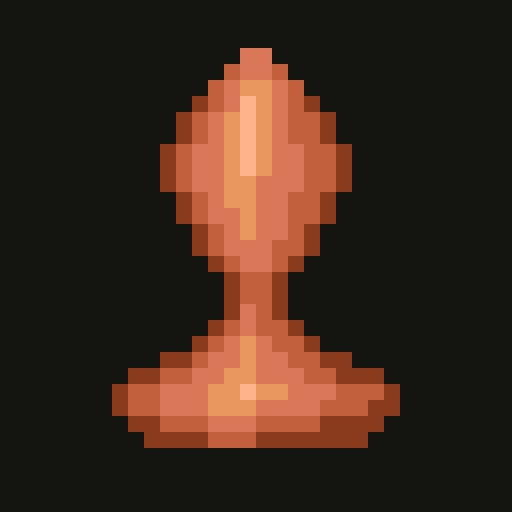

<p align="center">
  
</p>

<h1 align="center">buttplug-mcp</h1>

<p align="center">
  <strong>MCP server that gives Claude direct control over intimate hardware and game controllers via <a href="https://buttplug.io">buttplug.io</a></strong>
</p>

<p align="center">
  <code>vibrate</code> &middot; <code>rotate</code> &middot; <code>oscillate</code> &middot; <code>linear</code> &middot; <code>pulse</code> &middot; <code>wave</code>
</p>

---

An [MCP](https://modelcontextprotocol.io) server that connects Claude Code (or any MCP client) to [buttplug.io](https://buttplug.io) — the open-source intimate hardware control library. Claude gets tools to discover, control, and orchestrate haptic devices in real-time.

**Now with gamepad support.** Xbox, PlayStation, and Switch controllers work as vibration devices on macOS, Windows, and Linux — powered by our [SDL2 fork of intiface-engine](https://github.com/chiefautism/buttplug/tree/sdl-gamepad-support).

The LLM decides what you feel, and when.

## How It Works

```
Claude Code <-> MCP (stdio) <-> buttplug-mcp <-> WebSocket <-> intiface-engine <-> SDL2/BLE/USB <-> Device
```

buttplug-mcp auto-launches our forked intiface-engine when you call `connect`. No separate server to install or run. The engine handles:

- **Gamepads** (Xbox/PS/Switch) via SDL2 — cross-platform rumble
- **Bluetooth LE toys** (Lovense, We-Vibe, etc) via btleplug
- **USB/Serial devices** via platform drivers

## Getting Started

### Prerequisites

- [Bun](https://bun.sh) runtime
- [Rust toolchain](https://rustup.rs) (for building intiface-engine)
- [cmake](https://cmake.org) (for SDL2)

### Install

```bash
# Install Bun if you don't have it
curl -fsSL https://bun.sh/install | bash

# Install Rust if you don't have it
curl --proto '=https' --tlsv1.2 -sSf https://sh.rustup.rs | sh

# Install cmake
# macOS: brew install cmake
# Ubuntu: sudo apt install cmake
# Windows: choco install cmake

# Clone and install
git clone https://github.com/chiefautism/buttplug-mcp.git
cd buttplug-mcp
bun install
```

`bun install` will automatically clone our [buttplug fork](https://github.com/chiefautism/buttplug/tree/sdl-gamepad-support) and build intiface-engine with SDL2 gamepad support. This takes ~2 minutes on first install.

### Add to Claude Code

Create or edit `~/.claude/.mcp.json`:

```json
{
  "mcpServers": {
    "buttplug": {
      "command": "bun",
      "args": ["/absolute/path/to/buttplug-mcp/index.ts"]
    }
  }
}
```

### Go

Restart Claude Code. The tools are available immediately.

```
you: connect and scan for devices

claude: [calls connect] -> [calls scan]
        Connected. Found your Xbox Wireless Controller.
```

### Gamepad Setup

Connect your controller via **Bluetooth** (not USB — USB rumble is not supported on macOS):

1. Press and hold the Xbox/PS button until it flashes
2. Press the pairing button (small button near USB port on Xbox)
3. Go to System Settings → Bluetooth → Connect
4. In Claude Code: `connect` → `scan` → your controller appears

## Tools

| Tool | Description |
|---|---|
| `connect` | Connect to Intiface Engine (auto-launches if needed) |
| `scan` | Discover devices (gamepads, Bluetooth, USB) |
| `devices` | List connected devices |
| `vibrate` | Vibrate at intensity `0.0`-`1.0`, optional auto-stop timer |
| `rotate` | Rotate at speed `0.0`-`1.0` |
| `oscillate` | Oscillate at intensity `0.0`-`1.0` |
| `linear` | Move to position over duration (stroker devices) |
| `pulse` | Patterned pulses — count, on/off timing, intensity |
| `wave` | Smooth ramp between two intensities over time |
| `stop` | Stop one or all devices |
| `battery` | Read device battery level |
| `disconnect` | Disconnect and stop engine |

## Usage

Once connected, just talk to Claude. It has the tools — it'll figure it out.

```
you: give me a gentle pulse

claude: [calls vibrate(intensity=0.3)] -> [calls pulse(count=3)]
        Sent 3 gentle pulses to your Xbox controller.
```

```
you: slowly ramp up over 10 seconds then stop

claude: [calls wave(from=0, to=0.8, duration_ms=10000)]
        [calls stop]
```

All device parameters (intensity, speed, position) are normalized to `0.0`-`1.0`. Claude handles the mapping.

## Architecture

This project consists of two repositories:

### buttplug-mcp (this repo)
MCP server in TypeScript/Bun. Thin WebSocket client that speaks buttplug v3 protocol directly (no npm dependencies for device control). Auto-launches intiface-engine.

### [chiefautism/buttplug](https://github.com/chiefautism/buttplug/tree/sdl-gamepad-support) (fork)
Fork of [buttplugio/buttplug](https://github.com/buttplugio/buttplug) with a new crate: `buttplug_server_hwmgr_sdl_gamepad`. Adds cross-platform gamepad rumble via SDL2. Xbox/PS/Switch controllers appear as standard buttplug devices.

## Supported Devices

### Gamepads (via SDL2)
Any controller SDL2 supports with rumble: Xbox Series X/S, Xbox One, DualShock 4, DualSense, Switch Pro Controller, and more. Connected via Bluetooth.

### Intimate Hardware (via buttplug.io)
750+ devices from 30+ brands. Anything in the [buttplug.io ecosystem](https://iostindex.com/?filter0ButtplugSupport=7) works.

| Brand | Devices | Connection |
|---|---|---|
| **Lovense** | Lush, Hush, Edge, Nora, Max, Osci, Domi, and more | Bluetooth LE |
| **We-Vibe** | Sync, Melt, Vector, Nova, Chorus, Wish | Bluetooth LE |
| **Kiiroo** | Onyx+, Keon, FeelConnect, Titan | Bluetooth LE |
| **Satisfyer** | Curvy, Love Triangle, Sexy Secret | Bluetooth LE |
| **The Handy** | The Handy | Wi-Fi / API |
| **Magic Motion** | Flamingo, Awaken, Equinox | Bluetooth LE |
| **Lelo** | F1s, Hugo, Tiani | Bluetooth LE |
| **TCode** | OSR-2, SR-6, DIY devices | Serial / USB |

Full searchable database: [iostindex.com](https://iostindex.com/?filter0ButtplugSupport=7)

## Why

I saw girls on TikTok gooning with AI chatbots. Text-only. No haptics. Just vibes and imagination.

Thought — what if the chatbot could actually *touch* you? MCP gives LLMs tool use. Buttplug.io gives software device control. This glues them together. Now the AI doesn't just talk. It acts.

The hardware is already in the drawer. This is just the software.

## License

BSD-3-Clause
